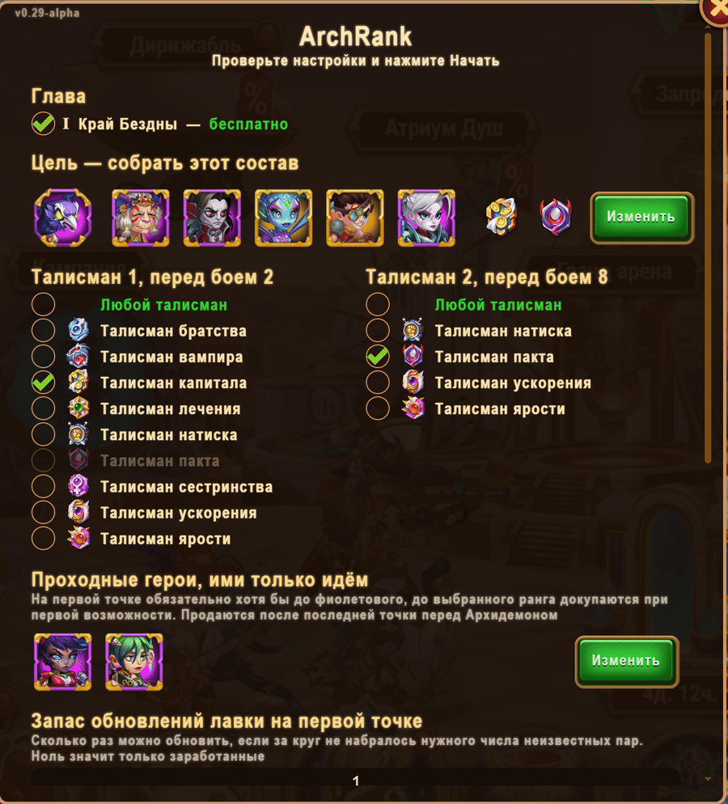
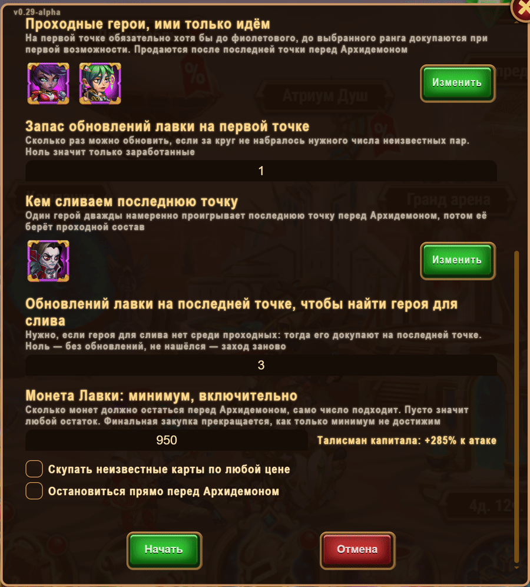

# HWHArchdemonExt

An add-on for HeroWarsHelper for the Archdemon event. It runs the free Abyss chapter, collects
the team you set and stops right before the Archdemon — you attack yourself.
If a run does not work out, it resets the chapter and tries again.

## Features

- **The goal is picked like in the game** — with a “Gather the team” window: up to five heroes
  with ranks 80/100/130, patrons, the main pet and two talismans.
- **Regular run** — buys the team before every point.
- **Run with the Talisman of Capital** — goes with cheap carry heroes, saves coins and buys
  the main team at the very end:
  - needed heroes are pinned in the shop along the way and bought in the final shopping,
    so coins are not spent early and go into the talisman bonus;
  - carry heroes with ranks, topped up along the chapter;
  - two deliberate losses on the last point for coins;
  - resale of profitable lots;
  - discounted pets are bought out and sold later, so the shop offers more heroes;
  - minimum Shop Coins with the talisman bonus shown: the shopping stops once it is out of reach.
- **Run log** on the right, a Stop button, an optional report before the final shopping.
- Paid Abyss chapters are never touched.

## Install

HeroWarsHelper is required. Import `HWHArchdemonExt.user.js` into Tampermonkey after it.
The item appears in the helper menu: **Others → Adventure (Arch)**.

## Screenshots

Show

